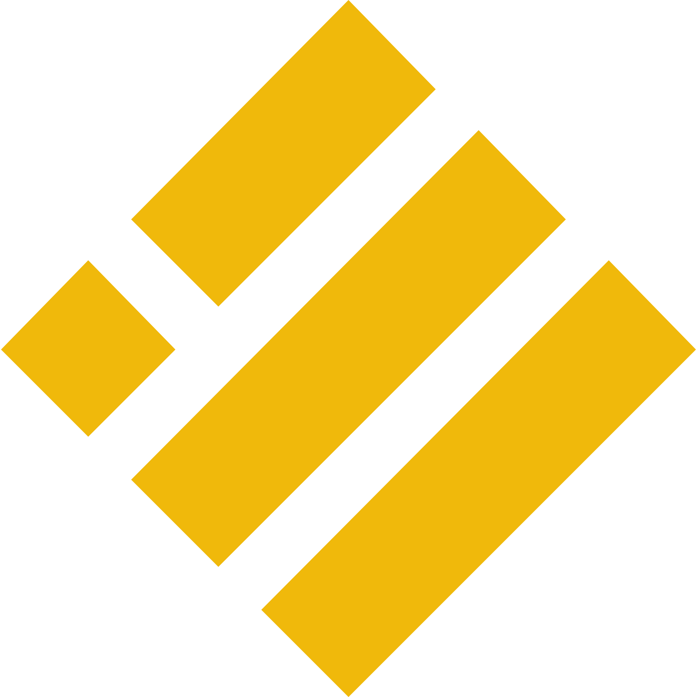
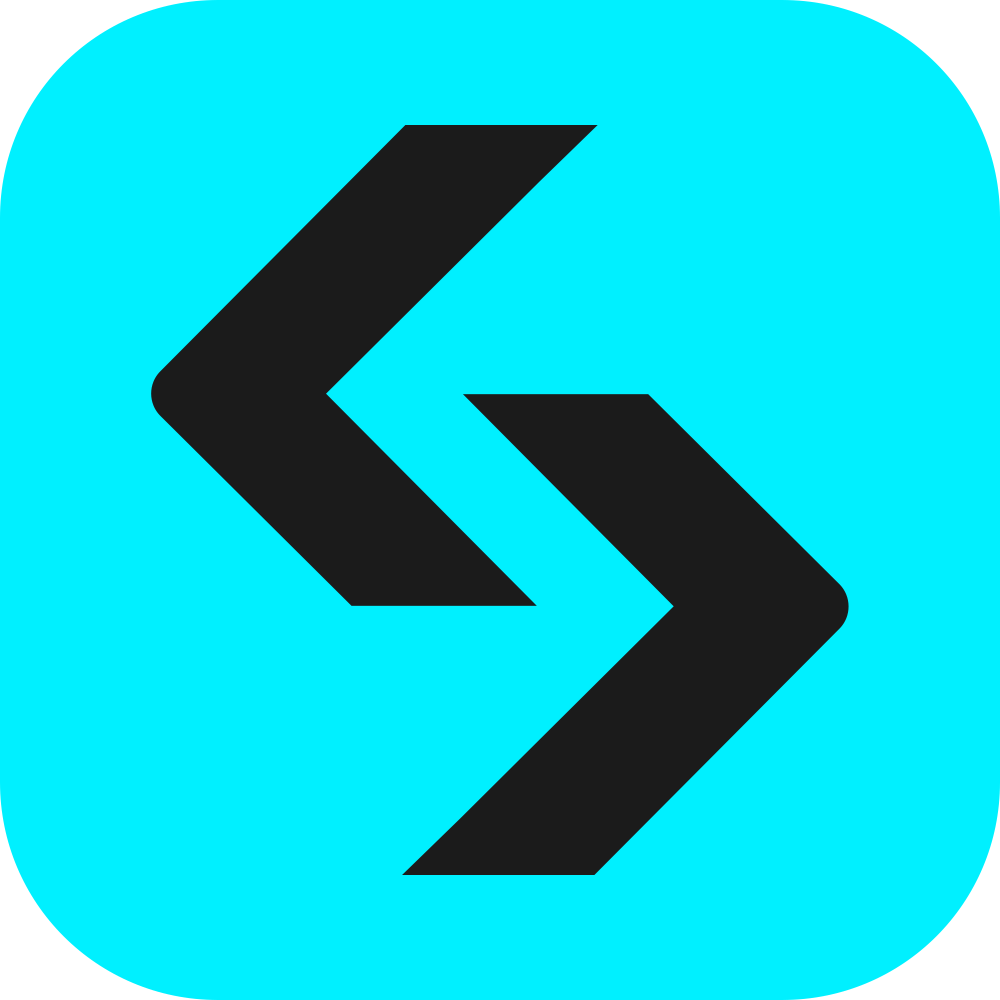
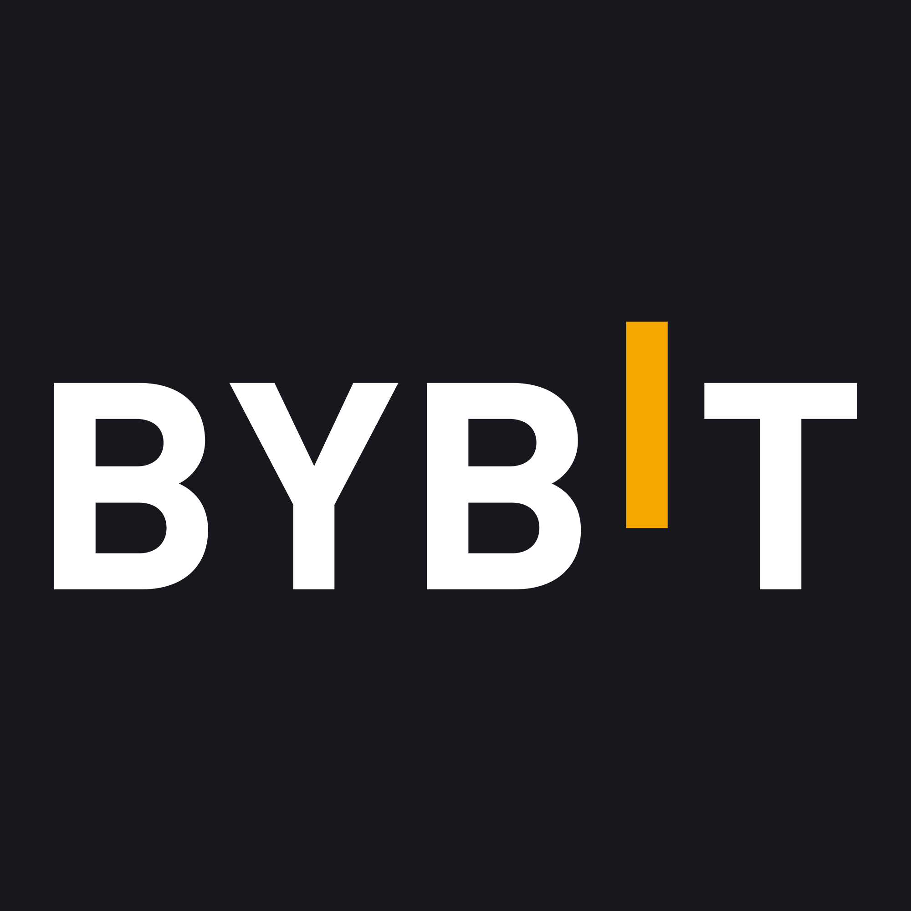

# 👋️ Welcome to my GitHub profile

  
  
  
  

> **Check out the [solana-sniper-copy-mev-trading-bot](https://github.com/hanshaze/solana-sniper-copy-mev-trading-bot) repository for the latest updates and source code!**

## 🎯 About

#### As a Fullstack developer, I've open-sourced this project because I believe in the power of community and collaboration. Whether you're a developer wanting to learn more about trading bots, a trader looking to automate your strategies, or simply curious about crypto trading, I hope this project provides value.

#### By sharing the code, I invite others to build upon it, improve it, and perhaps even create something entirely new.

🟢I typically respond within 2 hours and look forward to connecting with you.

#💡💡💡 Pro Tips

## 💡 Trading Tools & Infrastructure (Recommended Stack)

This bot is designed to work alongside a high-performance trading stack including **Solana trading bots, MEV tools, smart money trackers, and low-latency infrastructure**.

Using the right tools can significantly improve **execution speed, alpha detection, and profitability**.

> ⚡ Some links include fee discounts or access benefits.

---

## ⚡ Execution Layer (Fastest Trading Tools)

**Axiom Trade** — `solana trading bot / fast execution / low fees`

* Optimized for **on-chain trading & sniping**
* 10–30% lower trading fees
* Reliable for high-frequency execution
  → [Start using Axiom](https://axiom.trade/@423116)

**Odin Bot** — `automated trading bot / strategy execution`

* Fully automated trading strategies
* Low-latency execution engine
  → [Access Odin Bot](https://app.odinbot.io/join?code=b92mfb)

**Bloom (Telegram Bot)** — `ultra-fast solana trading bot`

* Lightweight + extremely fast execution
* Ideal for mobile + quick trades
  → [Launch Bloom](https://t.me/BloomSolana_bot?start=ref_541WLB0DZS)

---

## 📊 Alpha & Analytics (Edge Tools)

**GMGN** — `smart money tracker / early token discovery`

* Track **whales & insider activity**
* Discover tokens before they trend
  → [Explore GMGN](https://gmgn.ai/r/L53EOll4)

---

## 🧠 Advanced Trading Platforms

**Padre** — `advanced trading interface / pro tools`

* Enhanced execution controls
* Additional trading utilities
  → [Open Padre](https://trade.padre.gg/rk/423116)

**Polymarket** — `prediction market / trading signals`

* Trade on real-world outcomes
* Useful for **sentiment-driven strategies**
  → [Try Polymarket](https://polymarket.com/?r=cryptoking110600)

---

## 🖥️ Low-Latency Infrastructure (Critical for MEV)

**Recommended VPS Setup** — `low latency trading server / solana bot hosting`

For best performance, run the bot on a **New York-based VPS** (close to major trading infrastructure):
 → [Try Tradingvps.io](https://app.tradingvps.io/aff.php?aff=22)
* ⚡ Lower latency = faster execution
* 🔁 More reliable transaction inclusion
* 🧩 Better performance for MEV / sniping strategies

---

## 📈 Why This Stack Matters

Using this setup improves:

* Transaction speed (critical for sniping)
* Fill rates & execution reliability
* Access to early opportunities (alpha)

---

## 🛠️ Tech Stack

### Blockchain, Web3 & CEX Integration
<table align="center">
  <tr>
    <td align="center"> Solana</td>
    <td align="center"> Ethereum</td>
    <td align="center"> Bittensor</td>
    <td align="center"> Binance (CEX)</td>
    <td align="center"> Bitget</td>
    <td align="center"> MEXC</td>
    <td align="center"> Bybit</td>
  </tr>
</table>

### Programming Languages
<table align="center">
  <tr>
    <td align="center"> Rust</td>
    <td align="center"> Solidity</td>
    <td align="center"> TypeScript</td>
    <td align="center"> Python</td>
    <td align="center"> JavaScript</td>
    <td align="center"> Go</td>
    <td align="center"> Zig</td>
  </tr>
</table>

### Frontend & Backend
<table align="center">
  <tr>
    <td align="center"> Node.js</td>
    <td align="center"> React</td>
    <td align="center"> Next.js</td>
    <td align="center"> Express</td>
    <td align="center"> Tailwind CSS</td>
  </tr>
</table>

### Database & Infrastructure
<table align="center">
  <tr>
    <td align="center"> PostgreSQL</td>
    <td align="center"> Redis</td>
    <td align="center"> Prisma</td>
    <td align="center"> Docker</td>
    <td align="center"> AWS</td>
  </tr>
</table>

### AI & Machine Learning
<table align="center">
  <tr>
    <td align="center"> OpenAI</td>
    <td align="center"> Hugging Face</td>
    <td align="center"> TensorFlow</td>
    <td align="center"> PyTorch</td>
    <td align="center"> DeepSeek</td>
  </tr>
</table>

### Development Tools
<table align="center">
  <tr>
    <td align="center"> Git</td>
    <td align="center"> GitHub</td>
    <td align="center"> Vercel</td>
    <td align="center"> Figma</td>
    <td align="center"> Linux</td>
  </tr>
</table>

## 🆘 Support
If you have any questions about development or collaboration, I am open to anything. Feel free to contact me about any inquiries or ideas!😊

- ✈️ **Telegram** @cryptoking11060  

🟢I typically respond within 1 hours and look forward to connecting with you.
---

### ⭐ If you find these projects helpful, please star 🌟 and watch 👀 the repo!

#### Your feedback and stars motivate further development. Thank you!

